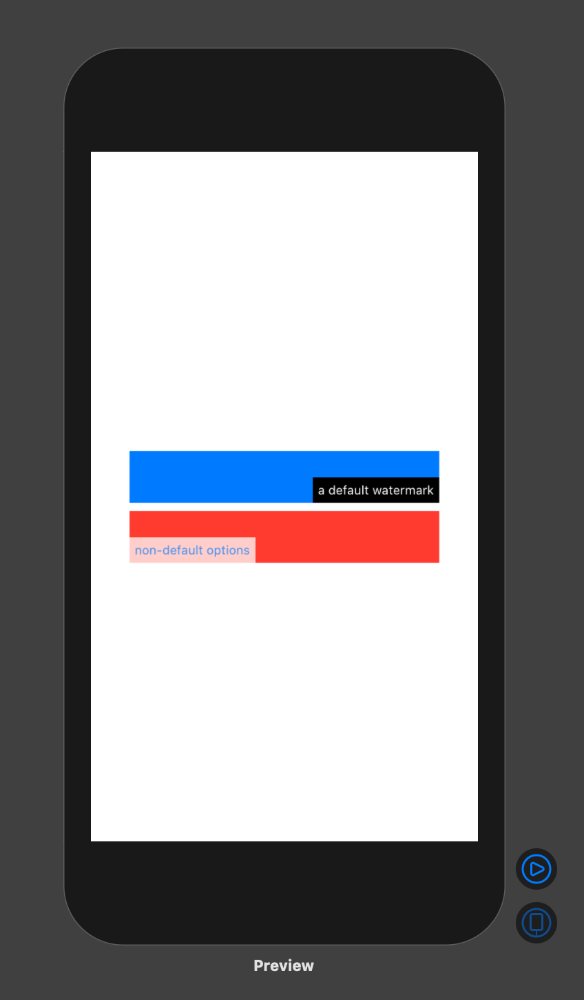

# Watermark

A SwiftUI ViewModifier to add a text watermark to a component.

## Usage

In your `Package.swift` file, add the following

~~~~swift
.package(url: "https://github.com/zachwick/watermark.git", from: "1.0.0")
~~~~

~~~~swift
import Watermark

struct ContentView: View {
  var body: some View {
    VStack {
      Color.blue
        .frame(width: 300, height: 50)
        .watermarked(with: "a default watermark")
      Color.red
        .frame(width: 300, height: 50)
        .watermarked(with: "non-default options", alignment: .bottomLeading, opacity: 0.75, foreground: .blue, background: .white)
    }
  }
}
~~~~

## License

Watermark is released under the MIT license
